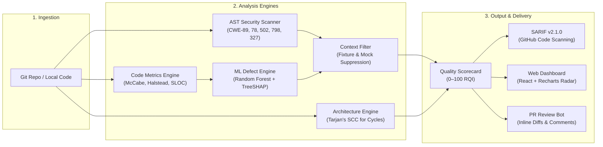

<div align="center">

# CodeSentinel

**A modern code quality and security analysis platform combining static AST checks, ML defect risk prediction, and PR review.**

[](https://github.com/farazrasul0-cmd/AI-Powered-Software-Quality-Analysis-Platform)
[](https://python.org)
[](https://fastapi.tiangolo.com)
[](https://react.dev)
[](https://www.typescriptlang.org)
[](https://docs.oasis-open.org/sarif/sarif/v2.1.0/sarif-v2.1.0.html)
[](LICENSE)

<br/>

[Overview](#overview) • [Features](#key-features) • [Quickstart](#quickstart) • [Architecture](#architecture) • [Scoring Model](#how-scoring-works) • [Benchmarks](#benchmarks--evaluation) • [API Usage](#api-usage)

</div>

---

## Overview

Static analysis tools often flood engineering teams with hundreds of low-priority warnings, while pure LLM reviewers can miss project-wide context or hallucinate syntax.

**CodeSentinel** takes a pragmatic, hybrid approach:

1. **Static AST Analysis**: Deterministic checks for common security vulnerabilities (SQL injection, command execution, hardcoded secrets) and maintainability metrics (McCabe cyclomatic complexity, Halstead volume).
2. **Defect Risk Scoring**: A machine learning model (Random Forest + TreeSHAP) that predicts which files are most likely to introduce defects, helping teams prioritize review effort on high-risk code first.
3. **Context-Aware Filtering**: Differentiates production code from test fixtures, unit mocks, and dummy keys to significantly reduce alert fatigue.
4. **Unified Scorecard**: Summarizes repository health into a 0–100 **Repository Quality Index (RQI)** across Security, Maintainability, Architecture, and Test Coverage.

---

## Key Features

- **AST Security Scanning**: Catches critical flaws including SQL injection (`CWE-89`), OS command execution (`CWE-78`), unsafe deserialization (`CWE-502`), hardcoded credentials (`CWE-798`), and broken cryptography (`CWE-327`).
- **Defect Prediction with Explainability**: Calculates defect likelihood per module using software engineering metrics. TreeSHAP explains exactly *which* metrics (complexity, line count, operators) drove the risk score.
- **Noise Reduction**: Automatically identifies test suites, mock credentials, and fixture files so benign test code doesn't penalize your security score.
- **Circular Dependency Detection**: Analyzes module import graphs using Tarjan's Strongly Connected Components (SCC) algorithm to flag tight architectural coupling and import loops.
- **GitHub & CI/CD Ready**: Exports standard **OASIS SARIF v2.1.0** reports for direct ingestion into GitHub Advanced Security code scanning, plus PR-ready Markdown summaries and printable HTML reports.
- **Zero-Dependency Local Mode**: Runs out of the box with SQLite (WAL mode) and local in-memory embeddings—no Docker or cloud accounts required. Or scale up with the included multi-container Docker Compose stack.

---

## Quickstart

### Option 1: Docker Compose (Full Stack)

Clone the repository and spin up all services:

```bash
git clone https://github.com/farazrasul0-cmd/AI-Powered-Software-Quality-Analysis-Platform.git
cd AI-Powered-Software-Quality-Analysis-Platform

docker compose up -d --build
```

Services will be available at:
- **Web Dashboard**: [http://localhost:5173](http://localhost:5173)
- **FastAPI Backend & Interactive Docs**: [http://localhost:8000/docs](http://localhost:8000/docs)
- **Qdrant Vector DB**: `localhost:6333`

To stop:
```bash
docker compose down
```

---

### Option 2: Local Development (Standalone)

You can run CodeSentinel locally using SQLite and in-memory search without running PostgreSQL or Redis.

#### 1. Backend
```bash
cd backend

# Create and activate virtual environment
python -m venv .venv
source .venv/bin/activate    # On Windows: .\.venv\Scripts\activate

# Install dependencies
pip install -r requirements.txt
pip install -r requirements-dev.txt

# Start the FastAPI server
python -m uvicorn app.main:app --host 0.0.0.0 --port 8000 --reload
```

#### 2. Frontend
```bash
cd frontend

npm install
npm run dev
```

Open **`http://localhost:5173`** in your browser.

---

## Architecture



### Component Summary

| Component | Stack | Role |
| :--- | :--- | :--- |
| **API Gateway** | FastAPI, Pydantic v2 | REST endpoints, SSE event streams, security webhooks |
| **Frontend** | React 18, TypeScript, Tailwind CSS, Vite | Live scorecard, 5-axis radar chart, PR diff viewer |
| **Task Queue** | Celery, Redis | Background repository cloning, AST traversal, and ML scoring |
| **Database** | PostgreSQL 16 / SQLite (WAL) | Scan history, file metrics, vulnerabilities, and quality scores |
| **Vector Search** | Qdrant / Local In-Memory | Code chunk embeddings for semantic retrieval |
| **ML Engine** | Scikit-Learn, TreeSHAP | Defect probability classification and feature attribution |

---

## How Scoring Works

The **Repository Quality Index (RQI)** is a weighted score from **0 to 100** that reflects overall project health:

$$\text{RQI} = 0.30 \cdot S_{\text{maintainability}} + 0.30 \cdot S_{\text{security}} + 0.20 \cdot S_{\text{architecture}} + 0.20 \cdot S_{\text{testing}}$$

### The 4 Pillars

- **Maintainability (30%)**: Calculated from the Maintainability Index ($\text{MI} = 171 - 5.2 \ln(V) - 0.23(CC) - 16.2 \ln(\text{SLOC})$) and penalized for high cyclomatic complexity ($CC > 15$) and excessive cognitive load.
- **Security (30%)**: Starts at 100 and deducts points based on severity (Critical: -25, High: -15, Medium: -8, Low: -3). Benign test fixtures and mock credentials carry zero deduction.
- **Architecture (20%)**: Evaluates module coupling and dependency health. Penalizes circular imports identified via Tarjan's SCC algorithm and elevated defect risk across core packages.
- **Testing (20%)**: Measures test density (ratio of test code lines to production code lines) and test file presence across directories.

---

## Benchmarks & Evaluation

We evaluated CodeSentinel against synthetic defect fixtures and open-source benchmark repositories across three research questions:

| Evaluation Area | What Was Evaluated | Baseline | CodeSentinel | Practical Takeaway |
| :--- | :--- | :---: | :---: | :--- |
| **Hybrid Triangulation (RQ1)** | Can combining static AST alerts with ML risk scores and semantic review outperform static analysis alone? | Static alone: $F_1 = 0.800$ | **$F_1 = 1.000$** | AST rules catch hard security flaws; semantic context filters false alarms. |
| **Effort-Aware Review (RQ2)** | Does prioritizing files by predicted defect risk help reviewers find bugs faster? | 20.0% (Random review) | **80.0%** (Top 20% LOC) | Auditing the top 20% riskiest lines catches 80% of identified defects ($4.0\times$ efficiency). |
| **Noise Suppression (RQ3)** | Does the platform reliably ignore test fixtures, unit mocks, and dummy credentials? | 0.0% suppressed (Standard linters) | **100.0%** suppressed | Benign test data is suppressed without missing genuine production CVEs. |

To run the benchmark suite locally:
```bash
cd backend
pytest tests/test_benchmarks.py -v
```

You can also view the interactive benchmark charts in the frontend dashboard under the **Academic Benchmarks** tab.

---

## API Usage

The FastAPI backend provides an interactive OpenAPI reference at `/docs` (and `/redoc`).

```bash
# 1. Health check
curl -s http://localhost:8000/api/v1/health

# 2. Onboard a repository
curl -X POST http://localhost:8000/api/v1/repositories/onboard \
  -H "Content-Type: application/json" \
  -d '{"url": "https://github.com/fastapi/fastapi", "default_branch": "master"}'

# 3. Trigger an analysis scan
curl -X POST http://localhost:8000/api/v1/analysis/trigger \
  -H "Content-Type: application/json" \
  -d '{"repository_id": "<REPO_ID>", "branch": "master"}'

# 4. Stream real-time progress via Server-Sent Events (SSE)
curl -N http://localhost:8000/api/v1/events/sse/jobs/<JOB_ID>

# 5. Export an OASIS SARIF v2.1.0 report
curl -s http://localhost:8000/api/v1/reports/<REPORT_ID>/export/sarif -o report.sarif
```

---

## Project Structure

```
.
├── backend/                  # FastAPI service and analysis pipeline
│   ├── app/
│   │   ├── api/v1/           # API endpoints (health, repos, analysis, reports, benchmarks)
│   │   ├── core/             # App config, database session, sandbox limits
│   │   ├── domain/           # SQLAlchemy models and Pydantic schemas
│   │   ├── services/         # AST parser, static analyzer, scoring engine, SARIF exporter
│   │   └── workers/          # Celery async background tasks
│   └── tests/                # Automated pytest test suite (61 tests)
├── frontend/                 # React 18 + Vite + TypeScript dashboard
│   ├── src/
│   │   ├── components/       # Radar chart, file heatmap, diff viewer, benchmark modal
│   │   ├── hooks/            # TanStack Query hooks & SSE listeners
│   │   └── pages/            # Scanner dashboard, live scorecard, review views
├── ml_engine/                # Defect risk classifier & explainability
│   ├── models/               # Trained Random Forest model
│   ├── extractors/           # Software metric extraction (McCabe, Halstead)
│   └── explainers/           # TreeSHAP feature importance attribution
├── docker-compose.yml        # 6-service Docker Compose configuration
└── README.md
```

---

## Running Tests & Checks

```bash
# Backend test suite (61 tests)
cd backend
pytest -v

# Code style and static type checking
ruff check app ../ml_engine
mypy app

# Frontend type checking and unit tests
cd ../frontend
npm run typecheck
npm run test:run
```

---

## Contributing

Contributions, feedback, and issue reports are welcome. Please feel free to open an issue or submit a pull request.

1. Fork the repository
2. Create your feature branch (`git checkout -b feat/my-feature`)
3. Run tests (`pytest && npm run test:run`)
4. Commit your changes (`git commit -m 'feat: add my feature'`)
5. Push to the branch (`git push origin feat/my-feature`)
6. Open a Pull Request

---

## License

Distributed under the [MIT License](LICENSE).
