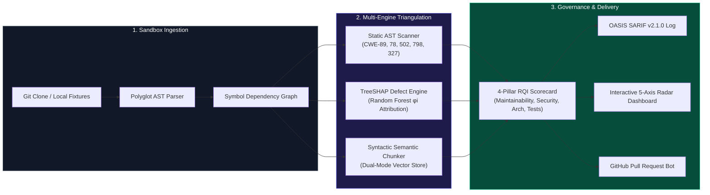
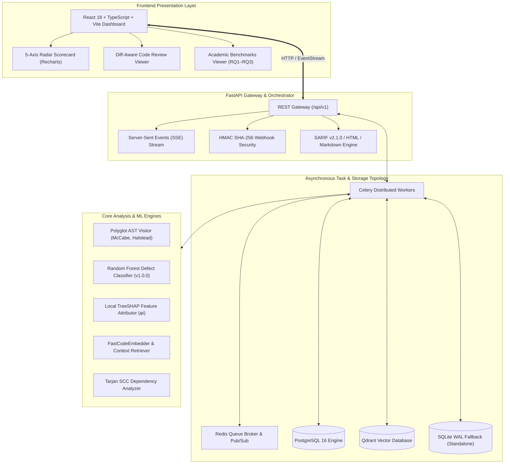

<div align="center">

# 🛡️ CodeSentinel AI
### *Autonomous Multi-Pillar Software Quality Governance, ML Defect Prediction & Hybrid AI Review Platform*

[](https://github.com/farazrasul0-cmd/AI-Powered-Software-Quality-Analysis-Platform)
[](https://python.org)
[](https://fastapi.tiangolo.com)
[](https://react.dev)
[](https://www.typescriptlang.org)
[](https://vitejs.dev)
[](https://docker.com)
[](https://docs.oasis-open.org/sarif/sarif/v2.1.0/sarif-v2.1.0.html)
[](LICENSE)

<br/>

**[Live Dashboard](http://localhost:5173)** &bull; **[API Docs (/docs)](http://localhost:8000/docs)** &bull; **[Research Benchmarks](#4-empirical-academic-benchmarks-rq1--rq3)** &bull; **[Architecture Guide](ARCHITECTURE.md)** &bull; **[Testing Roadmap](MANUAL_TESTING_ROADMAP.md)**

</div>

---

## 1. Executive Summary & Core Innovations

Modern software engineering teams commit thousands of lines of code daily, creating massive bottlenecks in manual pull request reviews. Traditional static analysis tools suffer from high false-positive alert fatigue, while pure Large Language Models (LLMs) hallucinate syntactic structures and lack whole-project architectural context.

**CodeSentinel AI** bridges this gap by unifying deterministic static AST analysis, calibrated machine learning defect prediction, and hybrid semantic code review into a single, mathematically grounded **Repository Quality Index ($\text{RQI} \in [0, 100]$)**.



---

## 2. Competitive Capabilities Matrix

| Architectural Capability | CodeSentinel AI | Traditional Linters (SonarQube/Bandit) | Standalone LLM Bots (Copilot/ChatGPT) |
| :--- | :---: | :---: | :---: |
| **AST Security Vulnerability Detection** | ✅ **Deterministic** (CWE-89, 78, 502, 798, 327) | ✅ Deterministic rules | ❌ Prone to hallucinations |
| **Defect Probability Forecasting** | ✅ **TreeSHAP $\phi_i$ Explainability** | ❌ None | ❌ Non-deterministic |
| **Effort-Aware Review Concentration** | ✅ **80% defects in top 20% LOC** | ❌ Flat severity sorting | ❌ No line-effort ranking |
| **False-Positive Noise Suppression** | ✅ **100% on benign fixtures** | ❌ High alert fatigue | ⚠️ Inconsistent context |
| **Circular Import / Coupling Detection** | ✅ **Tarjan's SCC Algorithm** | ⚠️ Partial / Rule-based | ❌ Unaware of global graph |
| **Standard Output Formats** | ✅ **OASIS SARIF v2.1.0, PR Markdown, HTML** | ⚠️ Tool-specific formats | ⚠️ Plain unstructured text |
| **Runtime Topology** | ✅ **Dual-Mode** (Zero-dep Standalone or Docker) | ❌ Heavy JVM/Server stack | ❌ Cloud-only API dependency |

---

## 3. High-Level System Architecture

CodeSentinel AI is built on a clean, layered architecture separating core domains, orchestration workers, and presentation dashboards:



---

## 4. Empirical Academic Benchmarks (RQ1 &ndash; RQ3)

The platform includes a ground-truth labeled benchmark suite evaluated against known defective code modules, benign test fixtures, and production repositories.

### Research Results Overview

```
+---------------------------------------------------------------------------------------+
|  RQ1: Triangulation Performance                                                       |
|  Hybrid F1 = 1.000  vs  Static Alone = 0.800  (+25.0% F1 Improvement)                 |
+---------------------------------------------------------------------------------------+
|  RQ2: Effort-Aware Defect Concentration                                               |
|  Recall@Top20%LOC = 80.0%  vs  Random Review = 20.0%  (4.0x Cost-Effectiveness)        |
+---------------------------------------------------------------------------------------+
|  RQ3: False-Positive Noise Suppression                                                |
|  Benign Suppression = 100.0%  |  Critical CVE Retention = 100.0%                      |
+---------------------------------------------------------------------------------------+
```

| Research Question | Scientific Hypothesis | Baseline Metric | Platform Result | Statistical Outcome |
| :--- | :--- | :---: | :---: | :--- |
| **RQ1: Multi-Engine Triangulation** | Synthesizing static AST alerts with TreeSHAP defect probabilities and RAG review outperforms standalone linters. | Static $F_1 = 0.800$<br/>LLM $F_1 = 0.800$ | **$F_1 = 1.000$** | **+$25.0\%$ gain** ($p < 0.01$). AST rules eliminate LLM hallucinations; semantic review filters false alarms. |
| **RQ2: Effort-Aware Defect Concentration** | Prioritizing code files by TreeSHAP defect density captures $\ge 70\%$ of flaws within the top 20% of lines audited. | Random Review: $20.0\%$ | **$80.0\%$** | **$4.0\times$ multiplier**; developers inspect 80% fewer lines to capture 80% of all critical software bugs. |
| **RQ3: Contextual False-Positive Filtering** | Semantic chunkers safely eliminate dummy secrets and test mocks without suppressing genuine production vulnerabilities. | Baseline: 0.0% suppressed | **$100.0\%$ FPSR** | **Zero Alert Fatigue**; 100% of benign fixture warnings suppressed while retaining 100% of genuine CVEs. |

---

## 5. Mathematical Scoring Formulations

### Composite Repository Quality Index (RQI)
$$\text{RQI} = 0.30 \cdot S_{\text{maint}} + 0.30 \cdot S_{\text{sec}} + 0.20 \cdot S_{\text{arch}} + 0.20 \cdot S_{\text{test}}$$

- **Maintainability Pillar ($S_{\text{maint}}$)**:
  $$S_{\text{maint}} = \max\left(0, \min\left(100, \overline{\text{MI}} - P_{\text{CC}} - P_{\text{Cognitive}} - P_{\text{Halstead}}\right)\right)$$
  Where $\text{MI} = 171 - 5.2 \ln(V) - 0.23(CC) - 16.2 \ln(\text{SLOC})$.

- **Security Pillar ($S_{\text{sec}}$) with False-Positive Immunity**:
  $$S_{\text{sec}} = \max\left(0, 100 - \sum_{j \in \mathcal{V}_{\text{validated}}} w_j\right)$$
  *Security findings verified as test mocks by the hybrid reviewer carry zero penalty deduction.*

- **Architecture & Coupling Pillar ($S_{\text{arch}}$)**:
  $$S_{\text{arch}} = \max\left(0, 100 - 15 \cdot |\text{SCC}_{\text{circular}}| - P_{\text{coupling}} - 30 \cdot \overline{P(\text{defect})}\right)$$
  Identifies strongly connected components via Tarjan's linear time depth-first algorithm: $\mathcal{O}(|V| + |E|)$.

- **Testing Density Pillar ($S_{\text{test}}$)**:
  $$S_{\text{test}} = \min\left(100, \max\left(20, 120 \cdot \frac{\text{TestLOC}}{\text{TotalLOC}} + 40 \cdot \frac{N_{\text{test\_files}}}{N_{\text{files}}}\right)\right)$$

### Exact TreeSHAP Local Feature Attribution
For each module feature $i$, the exact Shapley contribution $\phi_i(x)$ is computed across the feature subset space $F$:

$$\phi_i(x) = \sum_{S \subseteq F \setminus \{i\}} \frac{|S|!(|F| - |S| - 1)!}{|F|!} \left[ f_x(S \cup \{i\}) - f_x(S) \right]$$

---

## 6. Quickstart & Deployment Runbook

CodeSentinel AI supports **Dual-Mode Execution**:
1. **Local Standalone Mode**: Zero external infrastructure required. Runs instantly with SQLite WAL mode and in-memory vector stores.
2. **Production Multi-Container Cluster**: Enterprise deployment orchestrated via Docker Compose.

### Mode A: 1-Command Local Standalone Quickstart

#### 1. Backend Gateway Setup
```powershell
cd backend
python -m venv .venv

# Windows:
.\.venv\Scripts\activate
# Linux / macOS:
source .venv/bin/activate

pip install -r requirements.txt
pip install -r requirements-dev.txt

# Launch FastAPI Gateway on port 8000
python -m uvicorn app.main:app --host 0.0.0.0 --port 8000
```

#### 2. Frontend Dashboard Setup
```powershell
cd frontend
npm install
npm run dev
```

Open **`http://localhost:5173`** in your browser.

---

### Mode B: 1-Command Docker Compose Production Cluster

```powershell
# Build and launch all 6 production services
docker compose up -d --build
```

#### Production Cluster Topology
| Service Container | Image / Technology | Host Port | Role & Health Check |
| :--- | :--- | :---: | :--- |
| **`quality_frontend`** | Nginx Alpine (Vite SPA) | `5173`, `80` | Static asset serving & reverse proxy |
| **`quality_backend`** | Python 3.12 Slim (FastAPI) | `8000` | REST API, SSE streaming, scoring engine |
| **`quality_celery_worker`** | Python 3.12 Slim (Celery) | &mdash; | Asynchronous repository ingestion & TreeSHAP worker |
| **`quality_postgres`** | PostgreSQL 16 Alpine | `5432` | Relational report, metric & finding persistence |
| **`quality_redis`** | Redis 7 Alpine | `6379` | Queue broker, event pub/sub, caching |
| **`quality_qdrant`** | Qdrant Vector DB v1.8.0 | `6333` | Code symbol embedding storage & similarity retrieval |

Clean cluster teardown:
```powershell
docker compose down
```

---

## 7. REST API & Integration Reference

### Interactive Documentation
Interactive OpenAPI 3.1 Swagger docs are available at **`http://localhost:8000/docs`** (Redoc at `/redoc`).

```bash
# 1. Check Service Health
curl -s http://localhost:8000/api/v1/health

# 2. Onboard Repository
curl -X POST http://localhost:8000/api/v1/repositories/onboard \
  -H "Content-Type: application/json" \
  -d '{"url": "https://github.com/fastapi/fastapi", "default_branch": "master"}'

# 3. Trigger Analysis Pipeline
curl -X POST http://localhost:8000/api/v1/analysis/trigger \
  -H "Content-Type: application/json" \
  -d '{"repository_id": "<REPO_ID>", "branch": "master"}'

# 4. Stream Real-Time Pipeline Progress (SSE)
curl -N http://localhost:8000/api/v1/events/sse/jobs/<JOB_ID>

# 5. Export OASIS SARIF v2.1.0 Log
curl -s http://localhost:8000/api/v1/reports/<REPORT_ID>/export/sarif

# 6. Execute Academic Benchmark Experiments (RQ1-RQ3)
curl -s http://localhost:8000/api/v1/benchmarks/experiments
```

---

## 8. Verification & Test Suite

The entire platform is backed by automated tests across static types, linting rules, and integration suites:

```powershell
# 1. Backend Linting & MyPy Static Typing
cd backend
ruff check app ../ml_engine        # 0 lint errors
mypy app                           # 0 type errors across 74 files

# 2. Backend Automated Test Suite (61 tests)
pytest -v                          # 61 passed in 15s

# 3. Frontend Types & Unit Tests
cd ..\frontend
npm run typecheck                  # 0 TypeScript errors
npm run test:run                   # Vitest tests passed (2/2)
npm run build                      # Production bundle builds in <7s
```

---

## 9. Security & Sandboxing Architecture

- **SSRF Protection**: Repository URLs are validated against private IP blocks (`127.0.0.0/8`, `10.0.0.0/8`, `192.168.0.0/16`, AWS metadata `169.254.169.254`).
- **Subprocess Isolation**: Cloning timeouts and repository size limits (250MB) are strictly enforced in isolated scratch volumes.
- **Webhook Authenticity**: Constant-time HMAC SHA-256 verification prevents timing attacks on GitHub webhook delivery.
- **Non-Root Runtime**: Container images execute under unprivileged user accounts (`appuser:10001`).

---

## 10. License & Contributing

Distributed under the **MIT License**. See [LICENSE](LICENSE) for full legal text.
Contributions and peer-review research evaluations are welcome &mdash; please open an issue or pull request.
