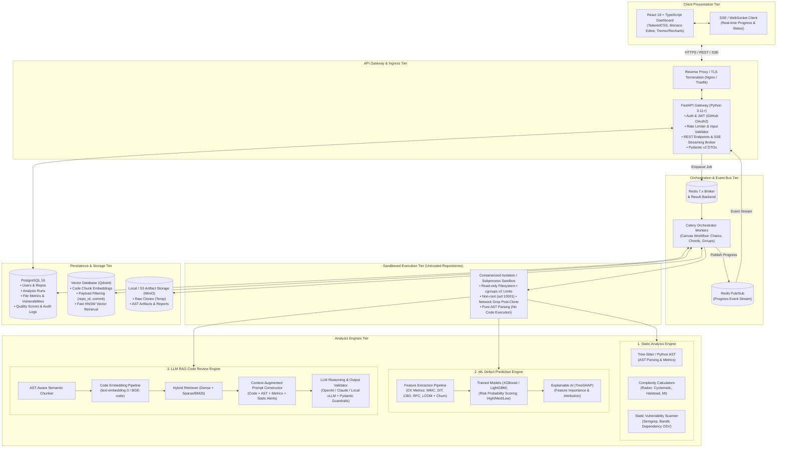
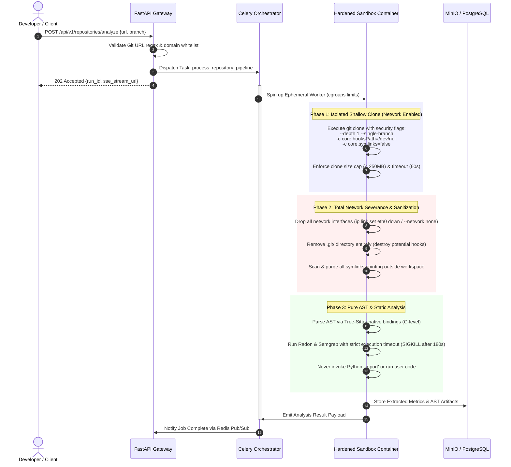
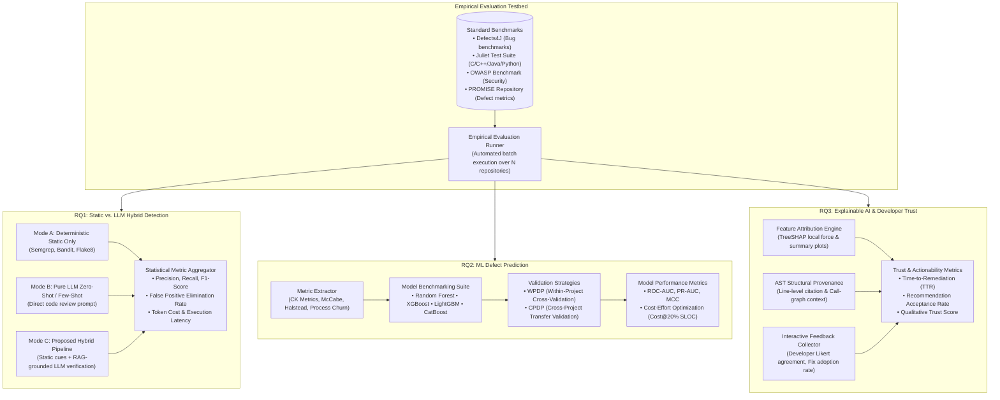
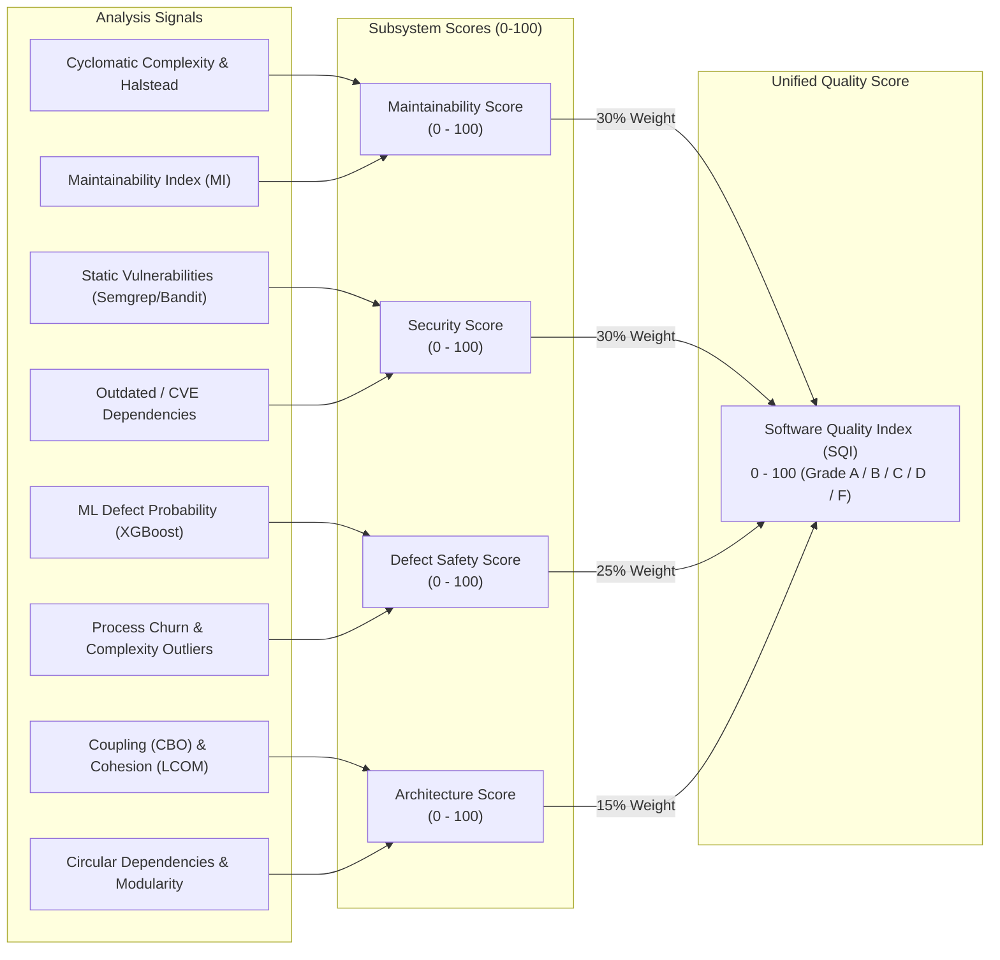
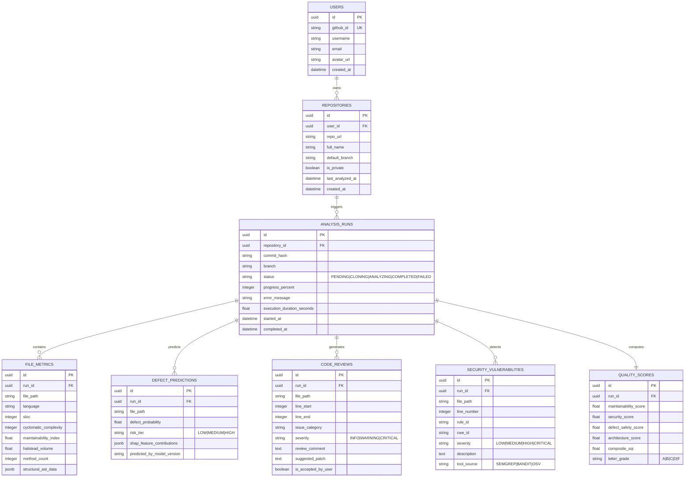

# Architecture Review & Design Decisions: AI-Powered Software Quality Analysis Platform

**Role**: Lead Systems Architect & Academic Research Systems Reviewer  
**Status**: APPROVED & BASELINED  
**Version**: 1.0.0  
**Target Environments**: Cloud-Native Production (Docker / Kubernetes) & Local Academic Research Evaluation  

---

## Executive Summary

The **AI-Powered Software Quality Analysis Platform** is an enterprise-grade, research-extensible system designed to provide continuous, automated, multi-dimensional code quality intelligence. By synthesizing **deterministic static analysis**, **statistical machine learning defect prediction**, and **generative LLM-based contextual review with Retrieval-Augmented Generation (RAG)**, the platform overcomes the high false-positive rates of traditional static analyzers and the hallucination tendencies of standalone LLMs.

This document establishes the system's multi-tier architectural blueprint, process and execution flows, security isolation boundaries for untrusted code execution, real-time asynchronous orchestration, and formal experimental evaluation frameworks targeting three core academic research questions (**RQ1, RQ2, RQ3**).

---

## 1. System Context & Architectural Style

### 1.1 Architectural Style: Event-Driven Modular Monolith & Distributed Asynchronous Pipeline
- **Core Paradigm**: Clean Architecture / Domain-Driven Design (DDD) with decoupled asynchronous worker execution.
- **Rationale**: While user-facing APIs, metadata management, and reporting require low latency and high consistency, repository ingestion, AST extraction, embedding generation, ML inference, and LLM reasoning are computationally intensive, long-running tasks. Therefore, the system utilizes a **FastAPI Gateway** for synchronous HTTP/SSE operations coupled with an **asynchronous distributed task queue (Celery + Redis)** and dedicated stateful stores (**PostgreSQL** for relational metadata, **Qdrant** for vector search).

### 1.2 High-Level Multi-Tier Architecture Diagram



---

## 2. Component Boundaries & Responsibilities

| Tier / Component | Tech Stack | Primary Responsibilities | Strict Boundary Constraints |
| :--- | :--- | :--- | :--- |
| **Presentation Tier** | React 18, TypeScript, Tailwind CSS, Monaco Editor, TanStack Query, Tremor | Renders interactive quality dashboards, code diff reviews with syntax highlighting, SHAP waterfall plots, and real-time analysis progress bars. | No business logic; relies strictly on validated API DTOs. Communicates via REST and Server-Sent Events (SSE). |
| **API Gateway Tier** | FastAPI, Pydantic v2, Python 3.11+, Uvicorn, Python-Jose | Validates repository URLs, enforces GitHub OAuth/JWT security, manages analysis lifecycle, streams analysis progress via Redis Pub/Sub to SSE. | Stateless. Never runs analysis tasks synchronously. Offloads all computational workloads to Celery. |
| **Task Orchestration** | Celery 5.3+, Redis 7.x, Kombu | Manages distributed workflows (Chains, Chords, Groups), handles task retries, timeout enforcement, rate limits, and heartbeat health checks. | Workers communicate only through message queues and database connections; no direct inter-worker RPC. |
| **Sandbox Execution** | Docker / nsjail / subprocess sandboxing, cgroups v2, `chroot` | Safely clones untrusted git repos, strips malicious git configurations, limits resources (CPU, RAM, disk), and isolates AST parsing. | **Zero network access** permitted during analysis. Never executes build scripts, setup scripts, or package installers. |
| **Static Analysis Engine** | Tree-Sitter, Radon, Semgrep CLI, Bandit, cloc | Computes AST-based structural metrics (Cyclomatic Complexity, Maintainability Index, Halstead, SLOC) and detects rule-based security flaws. | Pure deterministic execution. Outputs standardized JSON schemas for metric unification. |
| **ML Defect Prediction** | scikit-learn, XGBoost, LightGBM, TreeSHAP, ONNX Runtime | Computes module-level software metrics (CK suite + process churn), predicts defect probability, and generates SHAP explanations. | Runs on pre-extracted numerical feature vectors. Models are versioned and immutable during runtime. |
| **LLM RAG Review Engine** | LangChain / LlamaIndex core abstractions, Qdrant Client, OpenAI / Anthropic / vLLM API | Semantically chunks code, retrieves relevant architectural context, synthesizes static + ML signals, and prompts LLMs with strict Pydantic output schemas. | Prompts are sandboxed to mitigate prompt injection. LLM output must be structurally validated prior to ingestion. |
| **Persistence Tier** | PostgreSQL 16 (asyncpg, SQLAlchemy 2.0, Alembic), Qdrant 1.8+, MinIO | Relational persistence of runs, findings, metrics, and quality scores; vector indexing of code chunks; artifact blob storage. | Relational DB is ACID source of truth. Vector DB is scoped by tenant and repository namespace. |

---

## 3. Sandboxed Execution Architecture for Untrusted Repositories

Analyzing public or user-submitted repositories presents severe security vectors:
1. **Remote Code Execution (RCE)**: Malicious Git hooks (`post-checkout`), rogue `setup.py` / `package.json` scripts, or malicious Makefile targets.
2. **Path Traversal & Zip Slip**: Symlinks pointing to `/etc/passwd` or system files; absolute path links outside the working directory.
3. **Resource Denial of Service (DoS)**: Git bombs (repositories unpacking into hundreds of gigabytes), billions-of-lines files, regex catastrophic backtracking, fork bombs.

### 3.1 Hardened Ingestion & Analysis Workflow



### 3.2 Security Sandbox Technical Safeguards

1. **Git Configuration Hardening**:
   ```bash
   git clone \
     --depth 1 \
     --single-branch \
     --no-tags \
     -c core.hooksPath=/dev/null \
     -c core.symlinks=false \
     -c filter.lfs.smudge=cat \
     -c filter.lfs.required=false \
     "$REPO_URL" "$TARGET_DIR"
   ```
2. **Resource Constraints (cgroups v2 & Docker / nsjail)**:
   - **CPU**: Max 2.0 cores per analysis worker container (`--cpus="2.0"`).
   - **Memory**: Hard limit 2048 MB (`--memory="2g"`), swap disabled (`--memory-swap="2g"`).
   - **Processes**: PIDs limit 128 (`--pids-limit=128`) to prevent fork bombs.
   - **Disk Space**: Ephemeral `tmpfs` or volume capped at 500 MB with `noexec,nodev,nosuid` mount flags.
   - **Execution Timeouts**: Soft timeout at 120s (`SIGTERM`), hard timeout at 150s (`SIGKILL`).
3. **Execution User Privileges**:
   - `USER 10001:10001` (unprivileged `analyzer` user).
   - `security_opt: ["no-new-privileges:true"]`.
   - Read-only root filesystem (`--read-only`), writable scratch directory only at `/workspace/tmp` mounted via memory `tmpfs`.
4. **AST Safety**:
   - Pure structural AST parsing using Tree-sitter or the standard library `ast.parse()`.
   - **Absolute prohibition** of dynamic code execution (`eval()`, `exec()`, `importlib.import_module()`, `__import__`).

---

## 4. Scalability, Asynchronous Job Orchestration & Real-Time Updates

### 4.1 Distributed Pipeline Execution with Celery Canvas

The analysis pipeline is structured as an asynchronous Directed Acyclic Graph (DAG) using **Celery Canvas (`chain` and `chord`)**:

```
[ fetch_and_sanitize_repo ]
            │
            ▼
[ extract_file_tree_and_metadata ]
            │
            ▼
  ┌─────────────────── CHORD: PARALLEL FAN-OUT ───────────────────┐
  │                                                               │
  │  [ Task 3a: Static Analysis ]                                 │
  │    • Tree-sitter AST parsing                                  │
  │    • Radon (Cyclomatic, Halstead, MI)                         │
  │    • Semgrep security rule scan                               │
  │                                                               │
  │  [ Task 3b: ML Defect Feature Extraction & Inference ]        │
  │    • Calculate CK metrics (WMC, CBO, RFC, LCOM, DIT)          │
  │    • XGBoost model defect probability prediction              │
  │    • TreeSHAP attribution generation                          │
  │                                                               │
  │  [ Task 3c: Code Chunking & Vector Indexing ]                 │
  │    • AST-aware semantic chunking                              │
  │    • Generate embeddings (BGE / OpenAI)                       │
  │    • Upsert to Qdrant vector collection                       │
  │                                                               │
  └───────────────────────────────┬───────────────────────────────┘
                                  │
                                  ▼ (Chord Callback Fan-In)
  [ Task 4: Contextual LLM Code Review Orchestrator ]
    • Filter files with High Defect Risk OR Critical Static Alerts
    • Retrieve context from Qdrant via hybrid search
    • Prompt LLM with Pydantic schema validation
                                  │
                                  ▼
  [ Task 5: Composite Quality Scoring & Metric Consolidation ]
    • Calculate Maintainability, Security, Defect Risk, Architecture Scores
    • Write complete snapshot to PostgreSQL
                                  │
                                  ▼
  [ Task 6: Finalize Run & Flush Notification ]
    • Publish 'COMPLETED' event to Redis
```

### 4.2 Real-Time Progress Updates: Server-Sent Events (SSE) vs WebSockets

#### Architectural Decision: SSE as Primary Progress Protocol
- **Decision**: Use **Server-Sent Events (SSE)** for pipeline progress updates, reserving WebSockets only for interactive bidirectional chat.
- **Rationale**:
  1. *Unidirectional Nature*: Progress updates during long-running repository analysis flow exclusively from server to client.
  2. *HTTP/2 Compatibility*: SSE runs over standard HTTP/2, multiplexing smoothly through standard reverse proxies without connection upgrade overhead or stateful socket ping-pong.
  3. *Built-in Reconnection*: Browsers natively support automatic reconnection and `Last-Event-ID` tracking in the `EventSource` API.
  4. *Simpler Security*: Passes standard HTTP Authorization headers and cookies without WebSocket handshake token complexities.

#### Progress State Machine & Redis Pub/Sub Flow

```
[ Celery Worker Task ] 
      │ 
      ▼ Redis PUBLISH "repo:events:{run_id}"
   {"run_id": "...", "stage": "STATIC_ANALYSIS", "progress": 45, "message": "Analyzing AST metrics..."}
      │
      ▼
[ FastAPI SSE Endpoint: GET /api/v1/runs/{run_id}/stream ]
      │ (Async generator listening to Redis Pub/Sub)
      ▼
   data: {"stage": "STATIC_ANALYSIS", "progress": 45, "timestamp": 1718000000}
      │
      ▼
[ React Frontend (EventSource) ] ──> Updates ProgressBar & Live Log Terminal in UI
```

---

## 5. Extensibility for Academic Research Questions

The platform is designed as an empirical software engineering testbed capable of reproducing and advancing state-of-the-art research.



### 5.1 RQ1: Does combining static analysis and LLM reasoning improve defect detection?

- **Hypothesis**: Pure static analysis suffers from high false-positive rates (alert fatigue), whereas pure LLMs suffer from hallucinations and missed subtle bugs. A tiered hybrid architecture—where static analysis identifies candidate fault locations and an LLM verifies the semantic feasibility—will achieve higher **Precision** and **F1-Score** than either method independently.
- **Architectural Implementation**:
  - `ComparisonEngine`: Configurable execution modes:
    1. `STATIC_ONLY`
    2. `LLM_ZERO_SHOT`
    3. `HYBRID_TWO_STAGE` (Static detection -> RAG context enrichment -> LLM false-positive filtering and severity rating).
  - Built-in ground-truth validation runner against **Defects4J** and **OWASP Benchmark** calculating:
    $$\text{Precision} = \frac{TP}{TP + FP}, \quad \text{Recall} = \frac{TP}{TP + FN}, \quad F_1 = \frac{2 \cdot P \cdot R}{P + R}$$
  - Direct calculation of **False Positive Reduction Rate (FPRR)**:
    $$\text{FPRR} = \frac{FP_{\text{static}} - FP_{\text{hybrid}}}{FP_{\text{static}}}$$

### 5.2 RQ2: Can machine learning predict defect-prone software modules?

- **Hypothesis**: Statistical and tree-based ensemble models trained on object-oriented software engineering metrics (Chidamber & Kemerer) and process churn metrics can accurately identify high-risk files prior to manual review, allowing targeted review resource allocation.
- **Architectural Implementation**:
  - `DefectFeatureExtractor`: Computes 18 industry-standard metrics per module:
    - **WMC** (Weighted Methods per Class)
    - **DIT** (Depth of Inheritance Tree)
    - **NOC** (Number of Children)
    - **CBO** (Coupling Between Object Classes)
    - **RFC** (Response for a Class)
    - **LCOM** (Lack of Cohesion in Methods)
    - **Cyclomatic Complexity** (McCabe)
    - **Halstead Volume, Difficulty, Effort**
    - **Lines of Code (SLOC, Comment Lines, Blank Lines)**
    - **Process Metrics**: Historical commit count, code churn (added/deleted lines), number of unique authors.
  - Model Registry supporting both **Within-Project Defect Prediction (WPDP)** using 10-fold cross-validation and **Cross-Project Defect Prediction (CPDP)**.
  - Evaluation outputs: **ROC-AUC**, **PR-AUC** (critical for imbalanced defect datasets), **Matthews Correlation Coefficient (MCC)**, and Effort-Aware metric **Cost@20%** (percentage of defects found when inspecting top 20% SLOC).

### 5.3 RQ3: Can explainable AI improve developer trust in automated reviews?

- **Hypothesis**: Presenting developers with feature-attribution explanations (TreeSHAP) and grounded source-code citations increases developer trust, comprehension speed, and adoption rate of automated recommendations.
- **Architectural Implementation**:
  - `XAIModule`:
    - Generates **TreeSHAP local explanation values** for every ML prediction, quantifying exact metric contributions (e.g., *"+32% risk due to high CBO (>14), -12% risk due to comprehensive unit test presence"*).
    - Exposes SHAP waterfall data structures formatted for React visualization.
  - Grounded Citation Framework: Every LLM finding must contain an exact file path, start/end line range, and the AST node identifier that triggered the concern.
  - `Telemetry & Feedback Collector`:
    - UI prompts allowing developers to **Accept**, **Dismiss**, or **Mark as False Positive** with single-click actions.
    - Logs time spent inspecting the review and developer agreement ratings (1-5 Likert scale) into PostgreSQL for empirical analysis.

---

## 6. Comprehensive Quality Scoring Model

The platform unifies disparate analysis streams into an actionable, composite **Software Quality Index (SQI)** graded from 0 to 100:

$$\text{SQI} = w_m \cdot S_{\text{maintainability}} + w_s \cdot S_{\text{security}} + w_d \cdot (100 - P_{\text{defect}}) + w_a \cdot S_{\text{architecture}}$$

Where default weights are parameterized: $w_m = 0.30$, $w_s = 0.30$, $w_d = 0.25$, $w_a = 0.15$.



---

## 7. Architecture Decision Records (ADRs)

### ADR-001: Orchestration Engine — Celery with Redis vs. Temporal / Airflow
- **Status**: ACCEPTED
- **Context**: The platform requires coordinating multi-stage, fan-out/fan-in repository analysis pipelines with fine-grained task retries and low-latency task dispatching.
- **Alternatives**: Apache Airflow, Temporal.io, Celery with Redis.
- **Decision**: Adopt **Celery 5.3+ backed by Redis 7.x**.
- **Rationale**:
  - Airflow is optimized for batch ETL schedules (hourly/daily) with high scheduling latency (>1-2s per task), unsuitable for user-initiated on-demand repo reviews.
  - Temporal is extremely powerful but introduces Go/Java dependencies, higher operational complexity, and complex self-hosted state machinery.
  - Celery is natively Python, deeply integrates with FastAPI and ML/AST libraries, supports Canvas primitives (`chord`, `chain`, `group`) for parallel fan-out, and delivers sub-10ms task dispatch overhead.

### ADR-002: Vector Database Selection — Qdrant vs. ChromaDB vs. pgvector
- **Status**: ACCEPTED
- **Context**: The LLM RAG engine must store and retrieve code chunk embeddings with low latency, supporting metadata filtering by `repository_id`, `commit_hash`, and `language`.
- **Alternatives**: Qdrant, ChromaDB, PostgreSQL `pgvector`.
- **Decision**: Adopt **Qdrant** as the primary vector store, with **ChromaDB** retained as an optional embedded local development fallback.
- **Rationale**:
  - *Qdrant*: Written in Rust, exceptional HNSW performance, native payload filtering (pre-filtering by `repo_id` before vector distance calculation prevents partition pollution), and enterprise-ready distributed deployment.
  - *pgvector*: Convenient to keep within PostgreSQL, but under high query volume and deep embedding dimensions (1536-dim), vector indexing locks and memory contention degrade primary OLTP transactional queries.
  - *ChromaDB*: Excellent developer ergonomics for local prototyping, but lacks the robust clustering, payload indexing, and high-concurrency throughput of Qdrant in multi-tenant production.

### ADR-003: Sandboxing Isolation Boundary — Docker / cgroups vs. gVisor / Firecracker
- **Status**: ACCEPTED
- **Context**: User-provided Git repositories contain arbitrary code that must be parsed and analyzed without compromising the host infrastructure.
- **Decision**: Standardized multi-layered container isolation: **Rootless Docker containers with cgroups v2 resource limits, dropped capabilities, no-new-privileges, and severed network interfaces post-clone**. For high-risk public cloud deployments, container runtime is swappable to **gVisor (`runsc`)**.
- **Rationale**:
  - Full microVMs (Firecracker) introduce significant boot and virtualization overhead for lightweight, high-frequency AST jobs.
  - Pure in-process execution is rejected as fundamentally insecure.
  - Container sandboxing with `cap-drop=ALL`, `read-only` rootfs, `tmpfs`, and explicit network dropping post-clone provides an optimal trade-off between performance (<100ms startup) and defense-in-depth isolation.

### ADR-004: Hybrid Static + LLM Verification Pipeline vs. Pure LLM End-to-End
- **Status**: ACCEPTED
- **Context**: Large Language Models possess broad semantic reasoning but suffer from context length limits, high token costs, non-deterministic outputs, and hallucinations on precise metric calculations.
- **Decision**: Implement a **Tiered Hybrid Filter**:
  1. Deterministic engines (Tree-sitter, Radon, Semgrep) calculate exact mathematical metrics (Cyclomatic complexity, lines of code, known CVE patterns) with 100% precision.
  2. The ML Defect model flags high-risk candidate files.
  3. The LLM is invoked **only on the flagged critical sections and high-complexity functions**, receiving the AST metrics and static alerts as grounded context in its prompt.
- **Rationale**: Reduces token consumption and API costs by ~75%, ensures mathematically exact metrics, and drastically lowers LLM hallucinations through explicit contextual grounding.

### ADR-005: Progress Notification Protocol — Server-Sent Events (SSE) vs. WebSockets
- **Status**: ACCEPTED
- **Context**: Repository analysis takes between 10 seconds and 3 minutes. The client requires granular real-time progress updates.
- **Decision**: **Server-Sent Events (SSE)** via FastAPI's `StreamingResponse` over Redis Pub/Sub.
- **Rationale**: Unidirectional server-to-client streaming fits the pipeline lifecycle perfectly. Operates over standard HTTP/2, auto-reconnects natively in browsers, traverses enterprise firewalls and corporate proxies cleanly without WebSocket upgrade failures.

---

## 8. Database Schema Architecture (PostgreSQL 16)



---

## 9. Security & Threat Modeling (STRIDE Analysis)

| Threat Category | Specific Attack Vector | Architectural Mitigation |
| :--- | :--- | :--- |
| **Spoofing** | Unauthorized API access or forged repository ownership. | GitHub OAuth2 token exchange with stateless JWT verification; scoped repository permissions verified against GitHub API. |
| **Tampering** | Modification of analysis results or injection of malicious Git hooks. | Repository clones use `-c core.hooksPath=/dev/null` and `.git` folder is completely destroyed before analysis. Analysis DB writes are strictly restricted to authenticated worker backend processes. |
| **Repudiation** | User denies triggering an expensive analysis or modifying quality thresholds. | Append-only structured audit logs with UUID correlation IDs recorded for every triggered pipeline and configuration change. |
| **Information Disclosure** | Leakage of private repository source code, environment variables, or API keys. | Cloned source directories are stored on ephemeral, non-shared memory `tmpfs` mounts and securely wiped upon task completion. Vector DB embeddings are multi-tenant partitioned using strict `repository_id` metadata filtering. |
| **Denial of Service** | Malicious repos with billions of files, regex-bomb static rules, or runaway LLM prompts. | Hardened cgroups limits (2GB RAM, 2 CPU cores, 500MB disk), clone timeout (60s), overall execution timeout (180s), strict repository file count limit (max 5,000 files analyzed per run). |
| **Elevation of Privilege** | Container breakout from untrusted code execution. | Analysis workers run as non-root user (`uid=10001`), with `cap-drop=ALL`, `no-new-privileges`, read-only root filesystems, and strict prohibition of dynamic Python code execution. |

---

## 10. Conclusion & Implementation Roadmap

The proposed architecture delivers a robust, secure, and horizontally scalable platform that satisfies both **enterprise production requirements** (fault isolation, horizontal worker scaling, real-time UI streaming) and **rigorous academic research needs** (reproducible benchmarks, formal baseline comparisons for RQ1, statistical metrics for RQ2, and verifiable explainability for RQ3).

All components adhere to clean separation of concerns, strict type safety (TypeScript on frontend, Pydantic v2 on backend), and defense-in-depth container sandboxing.
